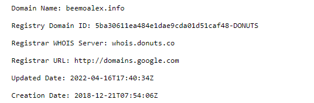

# 一開始

---

買這個網域已經有了四年的時間，起初想要簡單寫個網誌，偶爾需要火力展示什麼的想著想著覺得應該方便許多，自己有個網域感覺多拉風阿。

# 興致沖沖的開始

---

在GCP上租了主機，心想阿這就是網誌的開始，開始找資料查詢哪一個框架好，哪一個編輯器好寫。

> 最後選定了 [HEXO](https://hexo.io/zh-tw/) 作為框架
> 

網誌內容為了測試就打了建設中，像是要有甚麼偉大的建設一樣，圍上了施工布條。

# 荒廢期

---

**然後呢？**

然後？就沒有然後了。
架設主機後就像是蠟燭燃燒殆盡一樣，腦袋每次動手都在想為何要寫？

> 編輯文章並沒有編輯器好寫
Server每次都要push文章重新生成，並沒有建構CI/CD
覺得自己寫了沒人看，參考文章也是貼來貼去
寫了被人批評被人笑怎麼辦
> 

內心設想了無數的劇本。心裡想改天好了，何必這樣摧殘自己呢？上班都夠累了，就這樣過了一年。

某天機器通知被**[DDoS 攻擊](https://www.cloudflare.com/zh-tw/learning/ddos/syn-flood-ddos-attack/)，從**GCP轉至linode，又是搬阿搬拆阿拆，甚至還把建置流程寫了DockerFile方便又要搬移的作法。

就是不動鍵盤生出一篇文章。

雖然，從2020開始使用Notion寫了許多筆記，但始終沒有重新整理輸出到部落格上。

# 火種？

---

就這樣時間過了四年來到2022年，某天在FaceBook看到91寫到一篇 [我為什麼鼓勵工程師寫 blog](https://tdd.best/blog/why-engineers-should-keep-blogging/) 一文 引用了 [How To Achieve Ultimate Blog Success In One Easy Step](https://blog.codinghorror.com/how-to-achieve-ultimate-blog-success-in-one-easy-step/) 翻譯過來一段話：

> **挑個你自認為可以的時間行程安排，什麼時候開始寫 blog，預計多久寫一篇文，開始動工，並堅持下去。在你這麼做之前，任何建議對你來說都是不重要的**。你文章是否寫得很糟糕不重要，是否沒有任何人會看你的 blog 不重要，是不是沒啥有趣的東西可以紀錄也不重要。重要的是，只要你能透過寫文來表現出寫作的意願，而且渴望持續地寫作，檢視、思考與改善自己的寫作，你終究會成功的。
> 

看完這段話，我的確是想了太多。

# Notion寫上去跟Blog不一樣?

---

當開始撰寫時，就想著應該只要把Notion的筆記給倒出來就好？

**就好了吧？**

倒文章的當下發現了一堆即使我寫了也看不懂的文章反而占了一部分，步驟上也非常凌亂不堪。

事情看來沒有這麼簡單。於是在整理新的主題得時候，想著說不定會有人看了這邊文章操作，反而讓我更專注在有可能漏掉的地方，或是更注重步驟上的紀錄。

# 寫在這裡就是要救未來的自己

---

### 可能哪一天我要看或是哪一天有人要看？

### 雖然寫得很醜很爛又貼來貼去，但寫下去就對了吧

大概是這樣的想法開始寫Blog的開始，就像這個Blog名稱一樣**[隨堂測驗紙](https://www.beemoalex.info/)**。

因為想要紀錄步驟，找一個好寫且便宜的地方放在那裏讓我好尋找，為了自己而寫。

# 參考 感謝巨人們的肩膀 沒有你們就沒有這篇文章

---

[好文推薦——《我為什麼鼓勵工程師寫blog》 - Pin 起來！ (pinchlime.com)](https://pinchlime.com/2020/03/07/why-should-we-keep-blogging/)

[我為什麼鼓勵工程師寫 blog - 最好的 TDD 學習資源](https://tdd.best/blog/why-engineers-should-keep-blogging/)