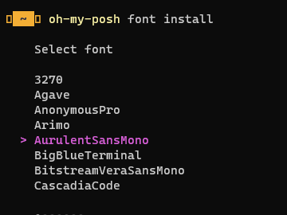
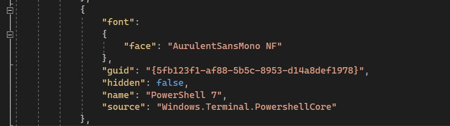
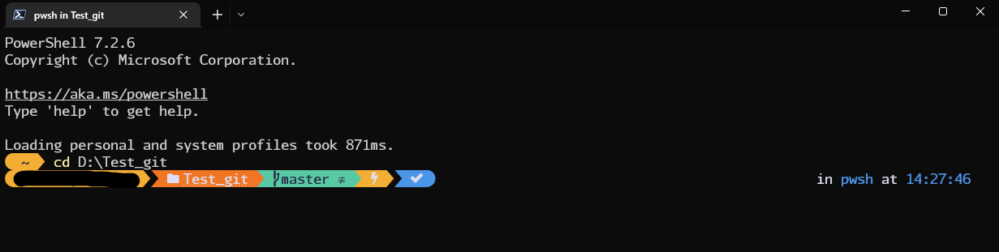

# 前言

---

以前還在前公司****Infra****職時，習慣用[Oh My Zsh](https://ohmyz.sh/) 美化自己的 terminal。

在這間公司時又懷念起 Linux體系的 [Oh My Zsh](https://ohmyz.sh/) terminal那樣的介面，於是又動手把它裝起來，git提示跟字體真的讓自己下語法會好蠻多的。

這陣子又有新環境要安裝，卻沒找到之前的步驟，這次還是乖乖地寫下來。

# 環境建置

---

1.使用PowerShell，先安裝[Windows Terminal](https://apps.microsoft.com/store/detail/windows-terminal/9N0DX20HK701?hl=zh-tw&gl=TW) 新版本
(可以去Store安裝也可，Win10都用winget了下個指令也行 )

```powershell
winget install Microsoft.WindowsTerminal -e
```

2.升級PowerShell 7 

```powershell
winget install Microsoft.PowerShell -e
```

改一下預設開啟[Windows Terminal](https://apps.microsoft.com/store/detail/windows-terminal/9N0DX20HK701?hl=zh-tw&gl=TW) 時為 PowerShell 7，改完後重開一下切成PowerShell 7


3.安裝 oh-my-posh

```powershell
winget install JanDeDobbeleer.OhMyPosh
```

修改一下PowerShell使用者配置檔，打開使用者配置檔案

```powershell
notepad $PROFILE
```

> 如果你是打不開的代表沒文件，請創建使用者配置檔
> 
> 
> ```powershell
> New-Item -Path $PROFILE -Type File -Force
> ```
> 

打開配置檔的記事本後，增加以下內容

```powershell
oh-my-posh init pwsh | Invoke-Expression
```

存檔後回到[Windows Terminal](https://apps.microsoft.com/store/detail/windows-terminal/9N0DX20HK701?hl=zh-tw&gl=TW) 讓他重新載入內容

```powershell
. $PROFILE
```


當看到前面這樣時別慌張，缺個字體而已

oh-my-posh輸入

```powershell
oh-my-posh font install
```

跑出字體選單，選一個喜歡的就好，

<aside>
💡 或是你去這裡挑也行，有範例可以看，自己可以下載安裝不用透過oh-my-posh install也行

[Nerd Fonts - Iconic font aggregator, glyphs/icons collection, & fonts patcher](https://www.nerdfonts.com/font-downloads)

</aside>

> 個人還是建議選Mono字體，等寬換行上才不會有多人協作換行問題
> 



下載完成後請按下 `CTRL + SHIFT + ,` 

跳出編輯視窗尋找 `profiles > list > name` 值為 PowerShell 7 的區塊，增加區塊 

face 值就是你剛剛下載字體的區塊，像我就選粗體的`AurulentSansMono`

```json
"font": 
{
		"face": "AurulentSansMono NF"
},
```

改好了就像這樣



> 為什麼不改 defaults ? 
改了之後 VS 底下的 終端機視窗符號無法顯示，建議改個指定來源就好
> 

重新啟動 [`Windows Terminal`](https://apps.microsoft.com/store/detail/windows-terminal/9N0DX20HK701?hl=zh-tw&gl=TW)

**完工**



## 額外補充

---

### 修改主題

如果真的嫌主題醜或是不實用可以上 [Themes | Oh My Posh](https://ohmyposh.dev/docs/themes) 看看喜歡的

打開配置文件 `notepad $PROFILE` 第一行更新

修改以下 **"$env:POSH_THEMES_PATH\{主題名稱}.omp.json"**  

範例:

```json
oh-my-posh init pwsh --config "$env:POSH_THEMES_PATH\gruvbox.omp.json" | Invoke-Expression
```

### ****posh-git git補完插件****

既然都裝了這些常常忘記git怎麼下，自然也是裝起來，使用`Install-Module` 功能下載安裝

```powershell
Install-Module posh-git -Scope CurrentUser -Force
```

完成後輸入依樣輸入 `notepad $PROFILE` 打開配置檔案，加入最後一行存檔

```powershell
Import-Module posh-git
```

重新載入使用者配置檔，輸入`. $PROFILE` 就能自動補上git指令了

# 參考 感謝巨人們的肩膀 沒有你們就沒有這篇文章

---

[如何打造一個華麗又實用的 PowerShell 命令輸入環境 | The Will Will Web (miniasp.com)](https://blog.miniasp.com/post/2021/11/24/PowerShell-prompt-with-Oh-My-Posh-and-Windows-Terminal)

[microsoft/terminal: The new Windows Terminal and the original Windows console host, all in the same place! (github.com)](https://github.com/microsoft/terminal)

[安裝新版 Oh My Posh 與插件來美化 PowerShell | 成功他媽．阿瑋 (kwchang0831.dev)](https://www.kwchang0831.dev/dev-env/pwsh/oh-my-posh#%E6%9B%B4%E6%94%B9-oh-my-posh-%E4%B8%BB%E9%A1%8C)

[Change your prompt | Oh My Posh](https://ohmyposh.dev/docs/installation/prompt)

[dahlbyk/posh-git： A PowerShell environment for Git (github.com)](https://github.com/dahlbyk/posh-git)