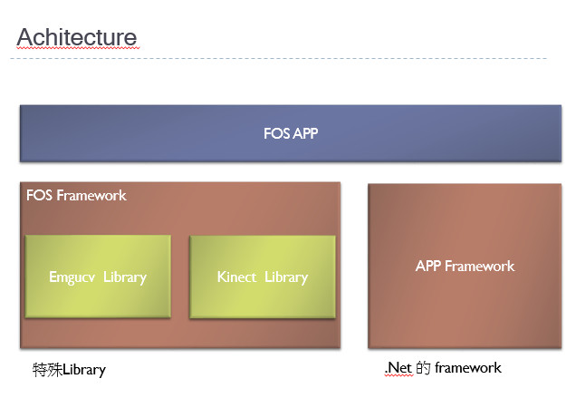
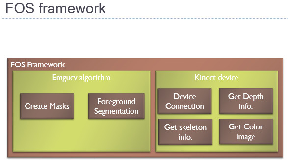

## **軟體架構 （Software Architecture）**

---

**軟體架構（Software Architecture）是一種軟體的藍圖，它告訴你這個軟體的結構，功能，介面，用法，與其他系統的構連以及資料交換等等規範，但它並沒有叫你要用什麼方式實作**

## 軟體框架（Framework）

---

**在一個既定的框架下可以做的工作**，也就是說，**這是一個已經成形的方法，而且有程式碼實體**
（例如鋼構工法也是要有鋼材才能做）**，並且會告訴你要如何使用它**（即 Framework Documentation，MSDN Library 即為一最佳例子）

## 分析

---

Framework 和 Architecture 經常被用來叫做架構，其實它們兩個本質上的差異是很大的，Framework 只會告訴你怎麼用，但不會告訴你怎麼實作出特定功能，而 Architecture 是告訴你某些功能的走向以及方針，但卻沒有程式碼給你，所以 Architecture 通常會需要 Framework 來實現，而 Framework 也需要 Architecture 才能發揮其所長。

## 同理可證

---

[1.   Net](http://1.Net) Core 可說是一個開發框架嗎?

是

1.  WebForm 和 MVC 究竟是 框架 還是一種 架構模式

架構，因為架構能可以有不同框架來實現(EX: .net Core MVC 範本)

1.  架構跟框架是不是同一種東西?

不是，架構偏於規範，框架則有程式碼或是已有套件

## 參考

---

[Architecture(架構) 和 Framework(框架) 有何不同?_軟體設計前的事前規劃的藍圖概念 (coolmandiary.blogspot.com)](https://coolmandiary.blogspot.com/2016/08/architecture-framework.html)

[Framework 和 Architecture 有何不同? | 小朱® 的技術隨手寫 - 點部落 (dotblogs.com.tw)](https://dotblogs.com.tw/regionbbs/2009/06/12/framework_vs_architecture)